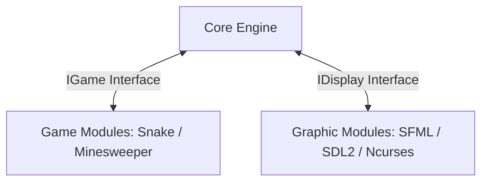

# 🕹️ Arcade Platform — Modular Game Engine

A highly modular and efficient entertainment platform developed in **C++20** that allows users to play a variety of classic games across different graphical rendering engines. Built for high flexibility and extensibility, the Arcade Platform utilizes dynamic library loading (`dlopen`/`dlsym`) to hot-swap modules on the fly without interrupting gameplay.

---

## 👥 Contributors & Contact

For any inquiries or collaboration requests regarding the Core engine or interfaces:
- **Ryad Younes**: ryad.younes@epitech.eu
- **Katia Pontre**: katia.pontre@epitech.eu
- **Julien Leiner**: julien.leiner@epitech.eu

---

## 📋 Table of Contents
1. [Core Features](#core-features)
2. [Technical Architecture](#technical-architecture)
3. [Prerequisites & Installation](#prerequisites--installation)
4. [Controls & Hotkeys](#controls--hotkeys)
5. [Adding Custom Games or Graphics Modules](#adding-custom-games-or-graphics-modules)

---

## 🌟 Core Features

* **Multi-Display Support**: Native wrappers for Ncurses (terminal mode), SFML (2D), and SDL2 (2D/OpenGL).
* **Hot-Swap Engine**: Switch between graphical backends dynamically during gameplay at the press of a key without losing your score or progression.
* **Classic Games Included**: Native modules for **Snake** and **Minesweeper**.
* **High Score Board**: Persistent tracking of best scores for each game.
* **Sound Effects & Music**: Comprehensive support for background audio (BGM) and game sound effects (SFX) where supported.

---

## 🏗️ Technical Architecture

The Arcade Platform is built around three strictly separated abstraction layers to enforce modularity:



### 1. The Core Engine
The main coordinator of the system. It handles the dynamic loading and unloading of library files (`.so`), captures user events, forwards updates to the active game, and handles frame synchronizations between the game loop and render engines.

### 2. Graphic Display Layer (`IDisplay`)
Interchangeable rendering backends. Whether you run inside a headless SSH console (Ncurses) or high-quality window mode (SDL2/SFML), the rendering output conforms to the standard `IDisplay` interface specifications.

### 3. Game Logic Layer (`IGame`)
All game logic is isolated inside shared libraries. This separation ensures that a crash or division-by-zero inside a specific game will not impact or compromise the core Arcade engine lifecycle.

---

## 🛠️ Installation & Compilation

### Prerequisites
Ensure you have the required graphic framework development libraries installed on your Unix environment:

```bash
# Update repository
sudo apt update

# Install GCC, CMake and compilation tools
sudo apt install build-essential g++

# Install SFML, SDL2, and Ncurses development packages
sudo apt install libsfml-dev libsdl2-dev libncurses5-dev libncursesw5-dev
```

### Build Commands

We provide a comprehensive Makefile to compile the platform components independently or all at once:

```bash
# Build the entire platform (Core, Games, and Graphics Libraries)
make

# Build only the Core executable
make core

# Build only the Game modules (.so library files)
make games

# Build only the Graphics rendering libraries (.so library files)
make graphicals

# Clean intermediate object files
make clean

# Remove all binaries and compiled libraries
make fclean

# Recompile the whole project
make re
```

All compiled module libraries will be output to the `./lib/` subdirectory.

---

## 🚀 Running the Game

Start the Arcade engine by executing the main binary and passing the path of your initial graphic library:

```bash
./arcade ./lib/arcade_sfml.so
```

*(You can replace `arcade_sfml.so` with `arcade_ncurses.so` or `arcade_sdl2.so` as desired).*

---

## 🎹 Controls & Navigation

### Main Menu
* **Arrows / ZS**: Move cursor.
* **Enter / E**: Select or launch.
* **L**: Toggle between graphics backends.
* **H**: Enable Hardcore (Challenge) mode.
* **Esc**: Exit Arcade.

### In-Game Control Actions
* **Arrows / ZSQD**: Control movements.
* **P**: Pause / Unpause gameplay.
* **M**: Mute / Unmute audio.
* **L**: Hot-swap graphics engine in real-time.
* **Esc**: Exit current game back to the Main Menu.

---

## 🔌 Adding Custom Games or Graphics Modules

Extending the platform is straightforward:
1. Implement the required interface:
   - For a game, inherit from the `IGame` C++ class interface.
   - For a renderer, inherit from the `IDisplay` C++ class interface.
2. Compile your implementation as a shared library (`.so`).
3. Place the compiled `.so` file inside the `lib/` directory.

The Arcade Core engine automatically scans this folder at startup, listing new libraries dynamically in the main menu catalog!
